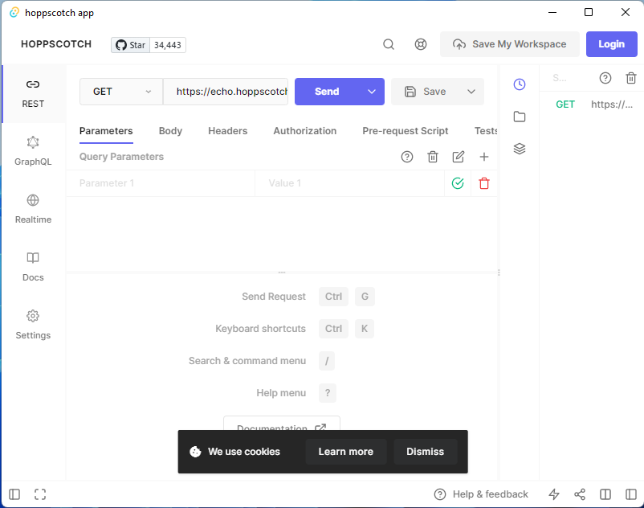

# hoppscotch-app 

This is a simple desktop version of [hoppscotch](https://github.com/hoppscotch/hoppscotch) which build with [Tauri](https://tauri.studio/).

It support windows (x86, x64, arm64), linux (amd64, i386, arm64, armhf), macos (x64, aarch64, universal) and android (apk, aab in universal). One single portable executable file or bundles/installers (msi/nsis for windows, deb/AppImage/rpm for linux, dmg for macos) are provided.

## Downloads

Current version: 25.5.3.

<table class="is-fullwidth">
</thead>
<tbody>
</tbody>
  <tr>
    <td align="center">
       
      Windows
    </td>
    <td>
      64-bit
      <a href="https://github.com/liudonghua123/hoppscotch-app/releases/latest/download/hoppscotch-app-windows-25.5.3_x64.exe">
        📦 Executable
      </a> |
      <a href="https://github.com/liudonghua123/hoppscotch-app/releases/latest/download/hoppscotch-app-windows-25.5.3_x64.msi">
        💿 MSI Installer
      </a> |
      <a href="https://github.com/liudonghua123/hoppscotch-app/releases/latest/download/hoppscotch-app-windows-25.5.3_x64-setup.exe">
        💿 NSIS Installer
      </a> 
      32-bit
      <a href="https://github.com/liudonghua123/hoppscotch-app/releases/latest/download/hoppscotch-app-windows-25.5.3_x86.exe">
        📦 Executable
      </a> |
      <a href="https://github.com/liudonghua123/hoppscotch-app/releases/latest/download/hoppscotch-app-windows-25.5.3_x86.msi">
        💿 MSI Installer
      </a> |
      <a href="https://github.com/liudonghua123/hoppscotch-app/releases/latest/download/hoppscotch-app-windows-25.5.3_x86-setup.exe">
        💿 NSIS Installer
      </a> 
      arm64
      <a href="https://github.com/liudonghua123/hoppscotch-app/releases/latest/download/hoppscotch-app-windows-25.5.3_arm64.exe">
        📦 Executable
      </a> |
      <a href="https://github.com/liudonghua123/hoppscotch-app/releases/latest/download/hoppscotch-app-windows-25.5.3_arm64_en-US.msi
">
        💿 MSI Installer
      </a> |
      <a href="https://github.com/liudonghua123/hoppscotch-app/releases/latest/download/hoppscotch-app-windows-25.5.3_arm64-setup.exe">
        💿 NSIS Installer
      </a> 
      
        ❓ Don't know which architecture of OS you installed? Execute <code>wmic os get osarchitecture</code> or Open System by clicking the Start button, right-clicking Computer, and then clicking Properties.
      
    </td>
  </tr>
  <tr>
    <td align="center">
       
      macOS
    </td>
    <td>
      Intel Processor
      <a href="https://github.com/liudonghua123/hoppscotch-app/releases/latest/download/hoppscotch-app-macos-25.5.3_x64">
        📦 Executable
      </a> |
      <a href="https://github.com/liudonghua123/hoppscotch-app/releases/latest/download/hoppscotch-app-macos-25.5.3_x64.dmg">
        💿 DMG bundle
      </a> 
      Apple M1 Processor
      <a href="https://github.com/liudonghua123/hoppscotch-app/releases/latest/download/hoppscotch-app-macos-25.5.3_aarch64">
        📦 Executable
      </a> |
      <a href="https://github.com/liudonghua123/hoppscotch-app/releases/latest/download/hoppscotch-app-macos-25.5.3_aarch64.dmg">
        💿 DMG bundle
      </a> 
      <a href="https://developer.apple.com/documentation/apple-silicon/building-a-universal-macos-binary">Universal</a>
      <a href="https://github.com/liudonghua123/hoppscotch-app/releases/latest/download/hoppscotch-app-macos-25.5.3_universal">
        📦 Executable
      </a> |
      <a href="https://github.com/liudonghua123/hoppscotch-app/releases/latest/download/hoppscotch-app-macos-25.5.3_universal.dmg">
        💿 DMG bundle
      </a> 
      
        ❓ Don't know which architecture of OS you installed? Learn more at <a href="https://support.apple.com/en-us/HT211814">apple.com</a>.
       
       
      <i>
      While Apple silicon machines can run applications compiled for Intel-based Macs through a translation layer called <a href="https://support.apple.com/en-gb/HT211861">Rosetta</a>, this leads to a reduction in performance due to processor instruction translations. It is common practice to let the user choose the correct target when downloading the app, but you can also choose to distribute a <a href="https://developer.apple.com/documentation/apple-silicon/building-a-universal-macos-binary">Universal Binary</a>. Universal Binaries include both <b>aarch64</b> and <b>x86_64</b> executables, giving you the best experience on both architectures. Note, however, that this increases your bundle size significantly.
      </i>
    </td>
  </tr>
  <tr>
    <td align="center">
       
      Linux
    </td>
    <td>
      64-bit
      <a href="https://github.com/liudonghua123/hoppscotch-app/releases/latest/download/hoppscotch-app-linux-25.5.3_amd64">
        📦 Executable
      </a> |
      <a href="https://github.com/liudonghua123/hoppscotch-app/releases/latest/download/hoppscotch-app-linux-25.5.3_amd64.AppImage">
        💿 AppImage bundle
      </a> |
      <a href="https://github.com/liudonghua123/hoppscotch-app/releases/latest/download/hoppscotch-app-linux-25.5.3_amd64.deb">
        💿 DEB bundle
      </a> |
      <a href="https://github.com/liudonghua123/hoppscotch-app/releases/latest/download/hoppscotch-app-linux-25.5.3.x86_64.rpm">
        💿 RPM bundle
      </a> 
      32-bit
      <a href="https://github.com/liudonghua123/hoppscotch-app/releases/latest/download/hoppscotch-app-linux-25.5.3_i386">
        📦 Executable
      </a> |
      <a href="https://github.com/liudonghua123/hoppscotch-app/releases/latest/download/hoppscotch-app-linux-25.5.3_i386.AppImage">
        💿 AppImage bundle
      </a> |
      <a href="https://github.com/liudonghua123/hoppscotch-app/releases/latest/download/hoppscotch-app-linux-25.5.3_i386.deb">
        💿 DEB bundle
      </a> |
      <a href="https://github.com/liudonghua123/hoppscotch-app/releases/latest/download/hoppscotch-app-linux-25.5.3.i386.rpm">
        💿 RPM bundle
      </a> 
      arm64
      <a href="https://github.com/liudonghua123/hoppscotch-app/releases/latest/download/hoppscotch-app-linux-25.5.3_arm64">
        📦 Executable
      </a> |
      <a href="https://github.com/liudonghua123/hoppscotch-app/releases/latest/download/hoppscotch-app-linux-25.5.3_arm64.deb">
        💿 DEB bundle
      </a> |
      <a href="https://github.com/liudonghua123/hoppscotch-app/releases/latest/download/hoppscotch-app-linux-25.5.3.aarch64.rpm">
        💿 RPM bundle
      </a> 
      armv7
      <a href="https://github.com/liudonghua123/hoppscotch-app/releases/latest/download/hoppscotch-app-linux-25.5.3_armhf">
        📦 Executable
      </a> |
      <a href="https://github.com/liudonghua123/hoppscotch-app/releases/latest/download/hoppscotch-app-linux-25.5.3_armhf.deb">
        💿 DEB bundle
      </a> |
      <a href="https://github.com/liudonghua123/hoppscotch-app/releases/latest/download/hoppscotch-app-linux-25.5.3.armhfp.rpm">
        💿 RPM bundle
      </a> 
      
        ❓ Don't know which architecture of OS you installed? Execute <code>uname -i</code> or <code>dpkg --print-architecture</code> or <a href="https://www.man7.org/linux/man-pages/man1/arch.1.html">arch</a> command.
      
    </td>
  </tr>
  <tr>
    <td align="center">
       
      Android
    </td>
    <td>
      universal
      <a href="https://github.com/liudonghua123/hoppscotch-app/releases/latest/download/hoppscotch-app-android-25.5.3-universal-release-unsigned.apk">
        📦 APK
      </a> |
      <a href="https://github.com/liudonghua123/hoppscotch-app/releases/latest/download/hoppscotch-app-android-25.5.3-universal-release.aab">
        💿 AAB bundle
      </a> 
      By default the generated AAB and APK is universal, containing all supported targets.
    </td>
  </tr>
</table>

## Does it work?

Yes! Quite well, actually - on macOS, Windows, and Linux.

## Credits

99% of the work was done over at [hoppscotch](https://github.com/hoppscotch/hoppscotch).

## License

MIT License

Copyright (c) 2023 liudonghua
